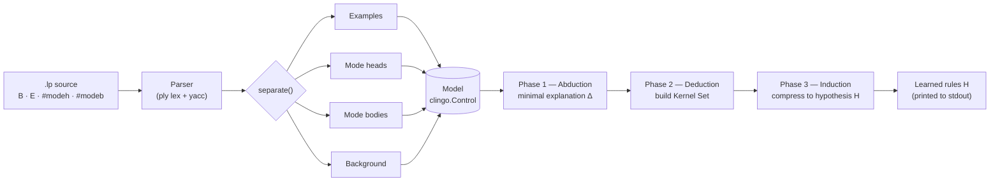
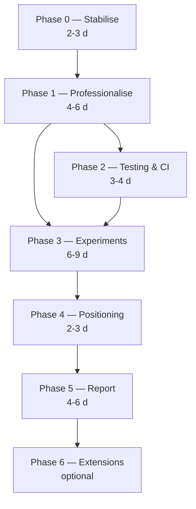

# XHAIL — Audit & Research-Engineering Roadmap

**Prepared:** 20 May 2026
**Branch:** `refactor/research-engineering`
**Scope:** Full code audit of the current repository plus a phased, prioritised plan to take XHAIL from an undergraduate dissertation prototype to a research-engineering portfolio project suitable for ML research-engineering roles and PhD/CDT applications.

This document changes nothing in the codebase. It is the planning artifact that the rest of the upgrade work will execute against. Every defect listed below was verified by reading the source and, where possible, by running the system.

---

## 1. Executive summary

XHAIL is a ~1,000-line Python reimplementation of the *eXtended Hybrid Abductive-Inductive Learning* paradigm — an Inductive Logic Programming (ILP) method that learns logic-program rules from background knowledge and examples through three stages: **abduction → deduction → induction**, built on the `clingo` Answer Set Programming (ASP) solver and a `ply` lexer/parser.

The good news: **the core algorithm works.** On the two well-formed example programs (`test.lp`, `josh.lp`) the pipeline runs end-to-end and produces correct, interpretable hypotheses — for the penguins task it learns `flies(V1) :- not penguin(V1).`, and for the traffic task it learns a sensible two-clause rule. That is a genuine, non-trivial achievement and the conceptual foundation is sound.

The problem: **as a repository, it is unmistakably an undergraduate dissertation artifact.** There is no packaging, no `.gitignore` (43% of tracked files are build junk), no dependency declaration, no tests, no CI, no configuration system, no CLI, and the README's own install instructions do not work. The parser crashes on two of the four bundled example files. The code silently requires Python 3.12+ with no declaration. The deduction phase fails to terminate on one input. None of this is visible from the README — which means anyone evaluating the repo discovers it the hard way.

**Honest grade.** As a dissertation, this is solid: it demonstrates real understanding of ILP and ASP, and a working tri-phase learner is more than many undergraduate projects achieve. As a *research-engineering portfolio piece* in its current state, it would not survive a technical reviewer cloning it — they would hit a broken install before seeing the interesting ideas. The gap is almost entirely **engineering and evaluation rigour**, not the algorithm.

**The plan.** Seven phases (a new Phase 0 plus the six in the project brief). Phase 0 stabilises correctness so later refactors are safe. Phases 1–2 make the repo professional and tested. Phase 3 builds the experimental and benchmarking framework — this is where "badly evaluated" gets fixed and is the highest-leverage work for credibility. Phases 4–5 supply the research framing and a publication-style report. Phase 6 is optional research extensions. Estimated total: **~21–31 focused days** of work, sequenced so that the repo is presentable after roughly the first third.

---

## 2. Current state — what works and what doesn't

### What works (verified by running)

| Example | Result | Status |
|---|---|---|
| `test.lp` (penguins) | Learns `flies(V1) :- not penguin(V1).` | ✅ Correct |
| `josh.lp` (traffic lights) | Learns `drive(V1) :- atlight(V1,V2), not red(V2).` and `drive(V1) :- emergency(V1).` | ✅ Correct |
| `example1.lp` (propositional) | `Syntax error at 'p'` → crash | ❌ Broken |
| `tests/deduction.lp` | No output after 35 s | ❌ Hangs |

The abductive, deductive and inductive phases are all implemented and, on clean input, chain together correctly. The compression heuristic (preferring hypotheses with fewer literals via ASP `#minimize`) behaves as intended.

### Repository metrics

| Metric | Value | Comment |
|---|---|---|
| Core Python source | ~1,000 lines (excl. generated/scratch) | Compact, readable |
| Git-tracked files | 32 | — |
| Build artifacts tracked in git | 14 (`__pycache__`, `.pyc`, `parser.out`, `parsetab.py`, `output/*.lp`) | **43% of the repo is junk** |
| `.gitignore` | None | — |
| `pyproject.toml` / packaging | None | Not installable as a package |
| `requirements.txt` | None | README tells users to `pip install -r` it anyway |
| Real tests | 0 | `tests/` holds one `.lp` *data* file, not tests |
| CI / linting / type-checking | None | — |
| `docs/` | None | — |
| Commits | 66 | Messages include `ITS WORKING!!!!!!!!`, `I think I saved it` |
| CLI / config | None | Input file and search depth are hardcoded in `xhail.py` |

### The honest weaknesses

A reviewer's first five minutes with this repo go: clone → read README → `git clone https://github.com/joshever/xhail.git` (**wrong URL** — the remote is `everettmakes/xhail`) → `pip install -r requirements.txt` (**file does not exist**) → `python xhail.py example.lp` (the script **ignores its argument** and runs a hardcoded file) → and if they are not on Python 3.12 it **fails to import at all**. Every one of those is a five-minute fix, and every one of them currently signals "prototype" before the reviewer ever reaches the actual ideas.

---

## 3. Verified defects (severity-ranked)

Severity key: **Critical** = breaks core functionality or blocks all downstream work · **High** = breaks common use or reproducibility · **Medium** = latent or silent correctness bug · **Low** = hygiene.

| ID | Sev. | Component | Defect | Evidence |
|---|---|---|---|---|
| D1 | Critical | `language/terms.py`, `language/structures.py` | Three nested same-quote f-strings (PEP 701) make the package **fail to import on Python < 3.12**. No version is declared anywhere. | `py_compile` under Python 3.10 fails on `terms.py:153`, `structures.py:142`, `structures.py:150` |
| D2 | Critical | `parser/parser.py` `p_constraint` | `Constraint(p[2], True)` is called with 2 args but `Constraint.__init__(self, body)` accepts 1. **Any input file containing a constraint crashes the parser.** | Ran a `not body.` constraint → `TypeError: __init__() takes 2 positional arguments but 3 were given` |
| D3 | High | `parser/parser.py` grammar | Propositional / 0-arity atoms (`p :- q, r.`) are unsupported — the grammar only accepts `PREDICATE LPAREN terms RPAREN`. The repo's own `example1.lp` cannot be parsed. | Ran `example1.lp` → `Syntax error at 'p' on line 1` |
| D4 | High | `parser/parser.py` `parseProgram` | Parse failure is not surfaced — `yacc.parse` returns `None`, then `separate()` does `for item in self.parsedData` → `TypeError: 'NoneType' object is not iterable`. The user sees a stack trace, not a useful error. | Observed downstream of D3 |
| D5 | High | `parser/parser.py` grammar | Standard ASP constraint syntax `:- body.` is unsupported; constraints must be written `not body.`. This is non-idiomatic and surprising. | Ran `:- penguin(a).` → `Syntax error at ':-'` |
| D6 | High | `reasoning/deduction.py` `runPhase` | Deduction does not terminate (or is unusably slow) on `tests/deduction.lp`; there is no depth/time guard surfaced to the user. Malformed input hangs instead of erroring. | Ran with a 35 s timeout → killed, no output |
| D7 | Medium | `reasoning/model.py` `getMatches` | `self.getClingoModels()[0]` assumes ≥1 model; on an UNSAT abductive program it raises `IndexError` instead of reporting "no explanation found". | Reproduced via a program whose abduction yields no model → `IndexError: list index out of range` |
| D8 | Medium | `language/terms.py` `Clause.replaceConstants` | Recursive call is `self.replaceConstants(self, term, matching)` — `self` is passed as the `atom` argument. Crashes whenever a clause contains a nested structured term. Latent only because current examples use flat terms. | Confirmed by reading; signature is `replaceConstants(self, atom, matching)` |
| D9 | Medium | `reasoning/deduction.py` `extractTerms` | Three `set.difference(...)` calls return new sets that are never assigned (should be `difference_update`). The intended body-term bookkeeping silently does nothing. | Confirmed by reading |
| D10 | Medium | `reasoning/model.py` `Model` | `program`, `clingo_models`, `best_model`, `delta`, `kernel` are **class attributes**, so state is shared across `Model` instances; two runs in one process leak into each other. | Confirmed by reading |
| D11 | Low | repo root | 14 build artifacts tracked in git; no `.gitignore`; `hey.lp` is a 0-byte file; loose `.lp` files and a `play/` scratch directory in the root. | `git ls-files` |
| D12 | Low | `README.md` | Wrong clone URL; references a non-existent `requirements.txt`; documents a CLI argument the script ignores. | Confirmed by reading |
| D13 | Low | `reasoning/deduction.py` `findNext` | Returns the string sentinel `["Mistake!"]` on an unexpected state instead of raising — silent corruption of the kernel. | Confirmed by reading |
| D14 | Low | `language/terms.py` | `MiscLiteral` is dead code; `Normal.type` is a class attribute used as mutable per-instance state; no docstrings; inconsistent type hints. | Confirmed by reading |

The headline: **D1–D6 alone mean the repository, as published, cannot be cloned and run by a stranger on a default modern Python without hitting at least one hard failure.** That is the single most damaging fact for a portfolio, and Phase 0 fixes all of it.

---

## 4. Architecture critique

### Current pipeline



The three-phase decomposition is faithful to the XHAIL paradigm and the package layout (`language/`, `parser/`, `reasoning/`) shows the author thought about separation of concerns. That instinct is correct and worth keeping.

### Where it falls short

**No public API or entry point.** Everything runs through `xhail.py`, a 34-line script with `DEPTH` and `INPUT_FILENAME` as literals. There is no function you can import and call, no return value — the learned hypothesis is `print()`-ed and then lost. Nothing downstream (a test, a benchmark, an experiment) can consume a result. **This is the single biggest structural blocker:** you cannot evaluate a system that has no callable interface.

**`Model` is a god object with shared mutable state.** It holds the program string, the clingo control, the model list, the kernel, and the abductive delta, and mutates all of them as class attributes (D10). Abduction, deduction and induction each reach into it and rewrite `program`. There is no immutable record of "what did each phase produce" — so debugging and result logging are near-impossible.

**The type system is stateful and order-dependent.** `Normal.setType()` mutates terms in place during `generalise()`, and `getVariables()` decides whether a term is a variable by checking whether its type string is non-empty. Type information therefore depends on which phase ran and in what order. This is fragile and is the most likely source of future correctness bugs.

**The parser is brittle.** It rejects propositional atoms (D3), rejects idiomatic constraint syntax (D5), and converts any parse failure into a downstream `NoneType` crash (D4). There is no error model at all — failures surface as Python tracebacks.

**No observability.** No logging, no structured output, no record of intermediate ASP programs except two files dumped into `xhail/output/` (and committed to git). When a run produces an unexpected hypothesis there is no way to inspect *why* without editing the source.

None of these are reasons to rewrite from scratch — the algorithm is the hard part and it works. They are reasons to **wrap the existing logic in a clean, callable, observable API** (Phase 1) so that everything else becomes possible.

---

## 5. What employers and PhD admissions actually look for

You selected all four priorities — engineering rigour, evaluation rigour, research credibility, and visual polish. Here is the rubric each maps to, and what "done" looks like.

**Engineering rigour** is what an ML research-engineering interviewer checks first, and they check it in literally five minutes: can I clone it, install it with one command, and run it? Is there a test suite and does CI show green? Is the structure legible — `src/` layout, real package, typed, documented? A reviewer rarely reads your algorithm; they read your `pyproject.toml`, your CI badge, and your test directory, and they extrapolate. This is cheap to fix and disproportionately high-signal.

**Evaluation rigour** is what separates a portfolio project from a *research* portfolio project, and it is exactly the weakness you named ("badly evaluated"). A learner with no benchmark, no baseline, and no metrics is an anecdote. The fix is a benchmark suite (canonical ILP tasks plus synthetic and noisy variants), at least one comparison system, and metrics beyond accuracy — runtime, memory, rule complexity, sample efficiency, and a deliberate failure analysis. PhD admissions in particular read this as evidence you can design and run an honest experiment.

**Research credibility** is what a prospective PhD supervisor or CDT panel weighs. They want a crisp research question, a defensible position relative to existing systems (ILASP, Aleph, Metagol, FastLAS, Popper), and — importantly — an *honest* statement of contribution. XHAIL is a known method (Oliver Ray, ~2009); reimplementing it is not a novel algorithm and you should not pretend otherwise. The credible contribution here is a clean, reproducible, rigorously characterised reference implementation plus an empirical study. Framed that way it is genuinely valuable; framed as "I invented XHAIL" it backfires.

**Visual polish** is the multiplier. The same result is worth more with an architecture diagram, a runtime-scaling plot with error bars, and a clean benchmark table than as a wall of stdout. It signals communication skill, which research engineering roles and PhD programmes both weigh heavily. It is the cheapest credibility per hour once the underlying results exist — but only *once they exist*, so it comes late.

The ordering implication: **engineering first (it gates everything and is fast), evaluation second (it is the core credibility win), research framing and report third, polish woven through the back half.**

---

## 6. Target architecture

```
xhail/
├── pyproject.toml            # packaging, deps, tool config (ruff/black/mypy/pytest)
├── README.md                 # rewritten: overview, install, reproduce, benchmarks
├── LICENSE
├── CITATION.cff              # makes the repo citable
├── .gitignore .pre-commit-config.yaml
├── .github/workflows/ci.yml  # test + lint + coverage on push
├── src/
│   └── xhail/
│       ├── __init__.py        # public API: learn(), version
│       ├── cli.py             # `xhail run config.yaml` entry point
│       ├── language/          # terms, structures (typed, documented)
│       ├── parser/            # parser + a clean error model
│       ├── reasoning/         # abduction, deduction, induction, model
│       ├── evaluation/        # metrics: accuracy, runtime, complexity...
│       └── io/                # result logging, JSON/CSV export
├── configs/                   # Hydra/YAML experiment configs
├── datasets/                  # benchmark .lp tasks (canonical + synthetic + noisy)
├── benchmarks/                # benchmark definitions + expected results
├── experiments/               # runnable experiment scripts
├── results/                   # gitignored: structured run outputs
├── tests/                     # real pytest suite (unit + integration + regression)
├── docs/                      # this file, architecture, API docs
└── scripts/                   # plotting, repro helpers
```

The key moves: a real `src/` package with a callable `learn()` API (so tests and benchmarks can consume results), a separate `evaluation/` module (so metrics are first-class, not afterthoughts), a config-driven `experiments/` layer (so every result is reproducible from a file), and a `datasets/`+`benchmarks/` split (so the "badly evaluated" problem is structurally solved). The loose root `.lp` files, the `play/` scratch directory, and the `xhail/output/` dump all disappear.

---

## 7. The roadmap — Phases 0 to 6

Effort is in *focused days* for one competent developer. Each task is grounded in a defect or gap identified above.

### Phase 0 — Correctness & stabilisation *(NEW — do this first)*

**Why it is new and first:** the project brief jumps straight to refactoring, but you cannot safely refactor or honestly benchmark a system that crashes on its own examples. Phase 0 makes XHAIL reliably runnable and pins its behaviour so every later change is verifiable.

- [ ] Fix D1 — replace the three nested f-strings; declare `requires-python` explicitly.
- [ ] Fix D2 — correct the `Constraint` constructor / `p_constraint` mismatch.
- [ ] Fix D3 + D5 — support propositional atoms and idiomatic `:- body.` constraints in the grammar.
- [ ] Fix D4 + D7 — add a real error model: parse failures and UNSAT abduction raise clear, typed exceptions.
- [ ] Fix D8, D9, D10 — the `replaceConstants` self-bug, the no-op set operations, and the shared class state.
- [ ] Add a depth/time guard for D6 so deduction fails loudly instead of hanging.
- [ ] Capture **golden-output regression tests**: pin the known-good hypotheses for `test.lp` and `josh.lp` so refactors cannot silently change behaviour.

**Deliverable:** every bundled example either runs correctly or fails with a clear message; behaviour pinned. **Effort: 2–3 days.**

### Phase 1 — Repository professionalisation

- [ ] Migrate to the `src/xhail/` layout; add `pyproject.toml` with editable install.
- [ ] Expose a public API — `xhail.learn(...)` returning a structured result object — and a real CLI replacing the hardcoded `xhail.py` (D12).
- [ ] Add `.gitignore`; untrack all 14 build artifacts; delete `hey.lp` and the `play/` scratch dir (D11).
- [ ] Pin dependencies (`clingo`, `ply`) with versions.
- [ ] Add Ruff + Black + mypy config and a `pre-commit` hook.
- [ ] Introduce structured logging and a config system (Hydra or plain YAML).
- [ ] Add type hints and docstrings throughout `language/` and `reasoning/`.
- [ ] Rewrite the README (overview, motivation, correct install, reproduction, roadmap link); add `CITATION.cff`.

**Deliverable:** a stranger can `pip install -e .` and run XHAIL in two commands. **Effort: 4–6 days.**

### Phase 2 — Testing & CI

- [ ] Unit tests: parser (incl. the D3/D5 edge cases), `generalise()`, type collation, each reasoning phase in isolation.
- [ ] Integration tests: full pipeline on each benchmark task.
- [ ] Edge-case + regression tests: empty background, UNSAT, noisy input, plus the Phase 0 golden outputs.
- [ ] GitHub Actions: run tests + Ruff + mypy on every push; coverage reporting; CI badge in the README.

**Deliverable:** green CI badge, meaningful coverage. **Effort: 3–4 days.**

### Phase 3 — Experimental framework *(highest-leverage phase)*

This phase directly fixes "badly evaluated" and is the strongest single signal for PhD admissions.

- [ ] Curate benchmark datasets: canonical ILP tasks (e.g. family relations, graph reachability, list/grid reasoning), **synthetic** reasoning tasks with controllable difficulty, **noisy-label** variants, and **scalability** variants that grow background size and example count.
- [ ] Implement an `evaluation/` module: accuracy/precision/recall, wall-clock runtime, peak memory, rule complexity (literal/clause counts), an interpretability proxy, and sample efficiency (accuracy vs. number of examples).
- [ ] Build config-driven experiments with fixed seeds, structured output folders, and CSV/JSON metrics export.
- [ ] Add at least one **baseline system** to compare against (a second ILP learner, or an ablation of XHAIL's compression heuristic).
- [ ] Produce the figures: runtime-scaling curves, rule-complexity plots, accuracy comparisons, and a failure-analysis chart — all with error bars over seeds.

**Deliverable:** one command reproduces every benchmark result and figure. **Effort: 6–9 days.**

### Phase 4 — Research positioning

- [ ] State a central research question and 2–3 falsifiable hypotheses (candidates in §9).
- [ ] Write a related-work comparison against ILASP, Aleph, Metagol, FastLAS and Popper.
- [ ] Write an honest contribution/novelty statement and an explicit limitations list.

**Deliverable:** a `docs/research.md` that frames the project for a supervisor. **Effort: 2–3 days.**

### Phase 5 — Technical report / mini-paper

- [ ] Draft the report: abstract, introduction, related work, methodology, experimental setup, results, discussion, limitations, future work.
- [ ] Produce publication-style assets: architecture diagram, pipeline diagrams, benchmark tables, figures from Phase 3.

**Deliverable:** a polished PDF mini-paper. **Effort: 4–6 days.**

### Phase 6 — Advanced extensions *(optional)*

Noisy symbolic learning, neuro-symbolic integration, probabilistic rule induction, LLM-assisted rule synthesis, explainability tooling. Pick **one** and treat it as a genuine research question rather than a checklist. **Effort: open-ended.**

---

## 8. Sequencing, milestones & effort



| Milestone | Reached after | What you can claim |
|---|---|---|
| **M1 — Runs reliably** | Phase 0 | "Clone it, it works." |
| **M2 — Looks professional** | Phases 1–2 | Portfolio-ready repo: packaging, tests, green CI. |
| **M3 — Rigorously evaluated** | Phase 3 | Benchmarks, baselines, metrics, figures — the credibility core. |
| **M4 — Research-framed** | Phases 4–5 | PhD/CDT-ready: research question, related work, mini-paper. |

**Critical path:** Phase 0 → Phase 1 → Phase 3 → Phase 4 → Phase 5. Phase 2 runs in parallel with the start of Phase 3. **Total: ~21–31 focused days**, and crucially the repo is *already presentable* at M2 (~roughly the first third) — so it can go on a CV before the research write-up is finished.

---

## 9. Research positioning

**Honest framing.** XHAIL is an established method (Oliver Ray, *Nonmonotonic abductive inductive learning*, ~2009), with a prior Java implementation. This project is a **Python/clingo reimplementation**, not a new algorithm. State that plainly. The defensible, genuinely valuable contributions are: (1) a clean, dependency-light, reproducible reference implementation; (2) a rigorous empirical characterisation of the abduce-deduce-induce paradigm — where its compression heuristic helps, how it scales, how it degrades under noise; (3) a reproducible benchmark harness comparing it to a modern ILP system.

**Candidate research questions** (each grounded in something the audit found):

- **RQ1 — Scalability.** How do runtime and learned-rule quality scale with background-knowledge size and example count? The deduction phase already shows combinatorial blow-up (D6) — characterising and bounding that is a real, honest research question.
- **RQ2 — Noise sensitivity.** How robust is the compression heuristic to label noise, and at what noise level does hypothesis quality collapse?
- **RQ3 — Comparative.** How does abduce-deduce-induce compare to a learning-from-failures approach (Popper) on the same tasks, in accuracy, runtime and rule complexity?

**Related work to position against:** Aleph (classic top-down Prolog ILP), Metagol (meta-interpretive learning), ILASP and FastLAS (learning under answer-set semantics), and Popper (learning from failures). A useful survey anchor is Cropper & Dumančić et al., *Inductive Logic Programming at 30*. Verify exact citations before they go in the report.

---

## 10. Risks & honest caveats

The deduction non-termination (D6) may be intrinsic to the algorithm on certain mode declarations rather than a simple bug — investigating it could itself become research work, and the time estimate for Phase 0 assumes a guard rather than a full fix. Effort estimates assume familiarity with the codebase (you wrote it) and may stretch if the type-system refactor uncovers further coupling. The benchmark curation in Phase 3 is the least predictable item: finding or building tasks that are non-trivial yet within XHAIL's expressivity takes experimentation. Finally, scope discipline matters more than completeness — a project that fully nails Phases 0–3 beats one that touches all six phases shallowly.

---

## 11. Immediate next steps

The recommended next session is **Phase 0**, in this order:

1. Fix D1 (the Python-version blocker) and declare `requires-python` — this is the highest-impact 30 minutes in the whole roadmap.
2. Fix D2–D5 (the parser crashes) so all four bundled examples either run or fail cleanly.
3. Add golden-output regression tests pinning `test.lp` and `josh.lp` before any refactor.
4. Fix the silent correctness bugs D8–D10.

All of this lands on the `refactor/research-engineering` branch, leaving `main` untouched for review.
